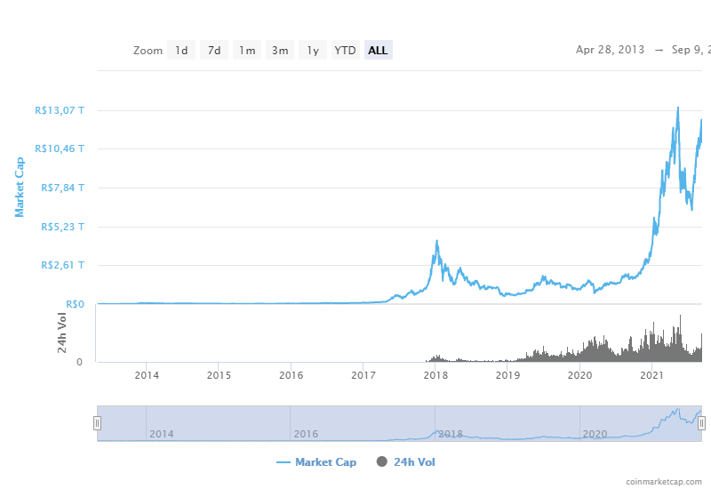

[![Contributors][contributors-shield]][contributors-url]
[![Forks][forks-shield]][forks-url]
[![Stargazers][stars-shield]][stars-url]
[![Issues][issues-shield]][issues-url]
[![MIT License][license-shield]][license-url]
[![LinkedIn][linkedin-shield]][linkedin-url]

<h1 align="center">Introdução a Criptomoedas</h1>

<!-- TABLE OF CONTENTS -->

  

    
Sumário

    <ol>
     <li>
       <a href="#inicio">Inicio</a>
     </li>  
     <li>
       <a href="#carteira-de-criptomoedas">Carteira de criptomoedas</a>
       <ul>
          <li><a href="#bitcoin-core-wallet">Bitcoin Core</a></li>
          <li><a href="#electrum-wallet">Electrum</a></li>
          <li><a href="#metamask-wallet">Metamask</a></li>
          <li><a href="#trust-wallet">Trust Wallet</a></li>
      </ul>
     </li>
     <li>
        <a href="#corretoras-de-criptomoedas">Corretoras de criptomoedas</a>
       <ul>
         <li><a href="#binance">Binance</a></li>
         <li><a href="#mercado-bitcoin">Mercado Bitcoin</a></li>
       </ul>
     </li>
     <li><a href="#tokens">Tokens</a></li>
     <li><a href="#mercado-de-criptomoedas">Mercado de criptomoedas</a></li>
     <li><a href="#considerações-finais">Considerações finais</a></li>
     <li><a href="#contact">Contact</a></li>
    </ol>
  

  

<!-- Inicio -->
## Inicio

Para entender as criptomoedas é necessário entender Blockchain.

Blockchain é um tipo de banco de dados que usa criptografia para armazenar as informações, uma vez que a informação é gravada ela nunca mais poderá ser alterada. 

Essa alta segurança no armazenamento de informações é um dos motivos que tornam a Blockchain uma tecnologia promissora. Atualmente o principal uso da tecnologia é voltado para a área financeira onde todas as transações envolvem dinheiro e por isso necessitam de extrema segurança.

Criptomoedas possuem esse nome justamente por serem transações feitas com criptográfia entre pessoas, ou melhor, entre carteiras digitais.
A mais famosa criptomoeda é o bitcoin.

O bitcoin só existe por que há uma Blockchain para ele, um fator importante é que todas as transações e até mesmo as carteiras estão dentro da Blockchain, por isso você deve entender como funciona a tecnologia para não correr riscos desnecessários.

Diferentemente dos bancos tradicionais que possuem informações pessoais tais como o saldo de cada cliente, na Blockchain essas informações pertencem somente ao usuário sem nenhuma empresa ou governo ter acesso a elas.

Você é responsável pela sua carteira, devendo portanto lembrar o código de acesso para ela, caso perca o acesso perderá também todo o dinheiro.

Existem diversas formas de entrar no mundo das criptomoedas, nesse repositório irei demonstrar 2 caminhos, o primeiro criando uma carteira e o segundo via corretoras de criptoativos.

Para maiores informações sobre o funcionamento do bitcoin e sobre Blockchain:

<a href="https://bitcoin.org/pt_BR/como-funciona">Como funciona o bitcoin</a>

<a href="https://blog.nubank.com.br/o-que-e-blockchain/">O que é blockchain</a>

**_Termos relacionados a tecnologia_**:
>Carteira = conta bancária

>Criptomoedas = transações entre carteiras dentro da Blockchain

>Blockchain = Banco de dados com criptografia

<!-- Criando a carteira para Criptomoedas -->
## Carteira de criptomoedas

Para interagir com a Blockchain do bitcoin, ethereum e demais criptoativos é necessario usar uma carteira com criptografia.

Neste tópico aprenda a fazer a sua carteira de criptomoedas de modo fácil e rápido.

Primeiro escolha uma wallet(carteira):
* Bitcoin Core
* Electrum
* Metamask
* Trust wallet

Abaixo você vai encontrar o tutorial de criação para cada uma delas, basta escolher a que mais se adequa ao seu objetivo.

<!-- Crypto wallet - Bitcoin core -->
 

  

  <h3 align="center">Bitcoin core - Wallet</h3>

  

    <a href="https://github.com/fernandosilvap96/criptomoedas/tree/main/bitcoin_wallet"><strong>Tutorial de como usar »</strong></a>
     
    <a href="https://bitcoincore.org/en/download/">Download</a>
  

<!-- Crypto wallet - Electrum -->
 

  

  <h3 align="center">Electrum - Wallet</h3>
 
  

    <a href="https://github.com/fernandosilvap96/criptomoedas/tree/main/bitcoin_wallet"><strong>Tutorial de como usar »</strong></a>
     
    <a href="https://electrum.org/#download">Download</a>
  

<!-- Crypto wallet - Metamask -->
 

  

  <h3 align="center">Metamask - Wallet</h3>

  

    <a href="https://github.com/fernandosilvap96/criptomoedas/tree/main/bitcoin_wallet"><strong>Tutorial de como usar »</strong></a>
     
    <a href="https://metamask.io/download.html">Download</a>
  

<!-- Crypto wallet - Trust Wallet -->
 

  

  <h3 align="center">Trust - Wallet</h3>

  

    <a href="https://github.com/fernandosilvap96/criptomoedas/tree/main/bitcoin_wallet"><strong>Tutorial de como usar »</strong></a>
     
    <a href="https://trustwallet.com/download-page">Download</a>
  

Caso nenhuma dessas carteiras lhe interesse, existem varias outras disponíveis na internet. O site <a href="www.bitcoin.org">www.bitcoin.org</a> cita algumas opções.

<!-- Corretoras de Criptomoedas -->
## Corretoras de criptomoedas

Outra forma de adquirir criptomoedas sem precisar criar carteiras crypto é abrir conta em corretoras.

As corretoras disponibilizam o acesso a várias criptomoedas, elas funcionam de forma semelhante a qualquer corretora de renda variável com login, senha, email, telefone... Pode-se fazer uma analogia para as criptomoedas com as ações de empresas, ambas possuem algumas caracteristicas similares.

Você pode acessar o mercado de criptomoedas que cada corretora possui. Existem diversas corretoras disponíveis, cada uma com seu próprio catálogo.

Abaixo você vai encontar um tutorial de como criar conta em duas corretoras, a Binance e o Mercado Bitcoin.

#### Binance

Binance é uma corretora Chinesa intitulada a maior corretora de criptomoedas do mundo. Ela possui milhares de criptomoedas no seu catálogo e seus recursos como corretora são os mais avaçados do mercado.

Site: <a href="https://www.binance.com/pt-BR">https://www.binance.com/pt-BR</a>

Para criar uma conta e aprender a usar os recursos da corretora <a href="https://github.com/">clique aqui</a>

#### Mercado Bitcoin

Mercado Bitcoin é a corretora brasileira mais conhecida, foi a primeira corretora especializada em criptomoedas no país.
Por ser nacional seu suporte e sua acessibilidade são melhores que os dos concorrentes.
Essa corretora não possui uma grande variedade de criptomoedas porém ela é ótima para quem está começando nesse mercado.

Site: <a href="https://www.mercadobitcoin.com.br/">https://www.mercadobitcoin.com.br/</a>

Para criar uma conta e aprender a usar os recursos da corretora <a href="https://github.com/">clique aqui</a>

<!-- Tokens -->
## Tokens

Além das criptomoedas disponiveis no mercado, existem também os tokens. Eles são negociados nas corretoras e também pertencem a Blockchain, tokens podem ser usados para outras finalidades além da simples transação de compra/venda entre carteiras, eles podem ser usados para representar produtos e serviços.

Há dois tipos de tokens no mercado, o utility token e o non fungible token(NFT), tokens utility servem para intermediar algum serviço ou produto, um exemplo de fácil entendimento é o Chiliz, um token que pode ser usado para comprar participações de clubes esportivos, com direito a diversos serviços específicos de cada clube, apesar de ser vendido e comprado, sua principal finalidade é ser trocado por serviços. 

NFTs são tokens únicos, ou seja, produtos criados virtualmente ou então produtos da vida real que foram digitalizados e gravados em alguma Blockchain e portanto não possuem cópias. Esse aspecto exclusivo de cada token eleva o valor deles, esse é um tema muito novo e com uma promessa de grande demanda para o futuro. Varias empresas e artistas estão explorando esse mercado em potêncial.

Notícia sobre algumas vendas de NFts com preços extremamente altos: <a href="https://forbes.com.br/forbes-tech/2021/04/os-10-nfts-mais-caros-da-historia/#foto10">https://forbes.com.br/forbes-tech/2021/04/os-10-nfts-mais-caros-da-historia/#foto10</a>

<!-- ROADMAP -->
## Mercado de criptomoedas

O mercado de criptomoedas é dinâmico e escalável porém cheio de esquemas de pirâmide e fraudes.
A jornada de uma criptomoeda começa no seu desenvolvimento, empresas iniciam projetos com a tecnologia Blockchain e então transformam esse projeto em uma criptomoeda/token para assim lançar o projeto no mercado e receber investimentos.

A criptomoeda estreia no mercado crypto por meio do ICO(Initial Coin Offerings) processo muito similar ao IPO no mundo das bolsas de valores. Após estreiar no mercado a criptomoeda começa a ter seu valor medido pelas transações diárias de compra e venda, quanto mais movimento de mercado a criptomoeda tiver, mais o valor dela vai subir.

Um excelente site para acompanhar o mercado de criptomoedas é o CoinMarketCap. <a href="https://coinmarketcap.com/">https://coinmarketcap.com</a> _Esse site pertence a Binance porém ele lista a maiorida das criptomoedas em circulação, mesmo as que não são encontradas na corretora_.

Para uma criptomoeda entrar no CoinMarketCap ela passa por diversos processos de legitmidade.

Caso queira acompanhar projetos recém iniciados, existem plataformas de negociação de novos projetos. 
Exemplo: <a href="https://uniswap.org/">Uniswap</a>

Existem ainda outras formas de ganhar dinheiro no mercado de criptomoedas, há jogos que você recebe por jogar como por exemplo o <a href="https://axieinfinity.com/">Axie infinity</a>

Loterias e mercado de futuros como por exemplo o <a href="https://pancakeswap.finance/">Pancakeswap</a>.

Ainda há como receber por emprestimo ou mineração de criptomoedas mas quanto mais complexo for o modo de investimento mais cuidado é necessário.

Enfim, opções não faltam. Cabe a você pesquisar e analisar os melhores investimentos.
O ganho pode ser expressivo porém o risco é extremamente alto, no mercado de criptomoedas nunca invista mais do que você está disposto a perder.

Uma dica que acho válida é diversificar seus investimentos ao máximo, nesse mercado com milhares de opções de criptomoedas seria um disperdício e um risco desnecessário concentrar seus investimentos em algumas poucas opções.

<!-- Considerações Finais -->
## Considerações finais

As criptomoedas estão em ascensão, o gráfico abaixo iluste bem o crescimento exponêncial desse mercado durante 2021.
Atualmente o valor desse mercado gira em torno de 11 trilhões de reais.

Devido ao alto risco de investimento principalmente por apresentar muita volatilidade, recomenda-se investir pouco e manter-se atualizado sobre as novidades da tecnologia Blockchain e a consolidação das criptomoedas no cenário mundial.

O ideal ao meu ver é adquirir criptomoedas via corretoras e depois migrar elas para sua carteira pessoal uma vez que as corretoras estão a merce de ataques hackers ou problemas politicos e legais. Sempre procure manter as suas criptomoedas em seu domínio mas nunca esqueça que se perder o código de acesso a carteira não terá como recuperar as criptomoedas.

Espero que esse reposítorio tenha te ajudado a entender um pouco sobre o universo de criptomoedas.

<!-- CONTATO -->
## Contato

Your Name - [@your_twitter](https://twitter.com/your_username) - email@example.com

Project Link: [https://github.com/your_username/repo_name](https://github.com/your_username/repo_name)

<!-- MARKDOWN LINKS & IMAGES -->
<!-- https://www.markdownguide.org/basic-syntax/#reference-style-links -->
[contributors-shield]: https://img.shields.io/github/contributors/othneildrew/Best-README-Template.svg?style=for-the-badge
[contributors-url]: https://github.com/othneildrew/Best-README-Template/graphs/contributors
[forks-shield]: https://img.shields.io/github/forks/othneildrew/Best-README-Template.svg?style=for-the-badge
[forks-url]: https://github.com/othneildrew/Best-README-Template/network/members
[stars-shield]: https://img.shields.io/github/stars/othneildrew/Best-README-Template.svg?style=for-the-badge
[stars-url]: https://github.com/othneildrew/Best-README-Template/stargazers
[issues-shield]: https://img.shields.io/github/issues/othneildrew/Best-README-Template.svg?style=for-the-badge
[issues-url]: https://github.com/othneildrew/Best-README-Template/issues
[license-shield]: https://img.shields.io/github/license/othneildrew/Best-README-Template.svg?style=for-the-badge
[license-url]: https://github.com/othneildrew/Best-README-Template/blob/master/LICENSE.txt
[linkedin-shield]: https://img.shields.io/badge/-LinkedIn-black.svg?style=for-the-badge&logo=linkedin&colorB=555
[linkedin-url]: https://linkedin.com/in/othneildrew
[product-screenshot]: images/screenshot.png
